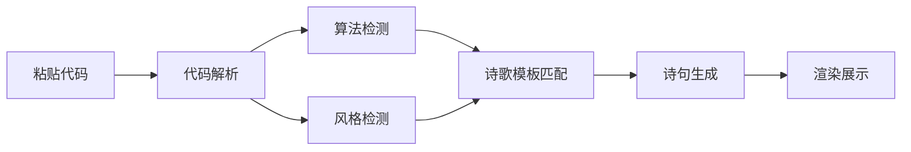

# CodePoet - 代码写诗生成器

## 1. 产品概述

将程序员日常代码转化为古典诗意，打造"赛博朋克诗人"的独特体验。用户粘贴代码，系统提取关键字、识别算法模式、分析代码风格，结合精心设计的诗词模板库，生成富有哲理的诗句。

核心价值：
- 让枯燥的代码焕发诗意
- 提供洛谷社区的猎奇娱乐体验
- 支持一键分享生成的诗句

## 2. 核心功能

### 2.1 主要功能模块

1. **代码输入区**
   - 大文本框，支持粘贴任意代码
   - 等宽字体显示
   - 内置6个经典代码示例快捷按钮

2. **算法检测引擎**
   - 识别30+种算法（排序、搜索、图论、动态规划等）
   - 代码风格检测（命名规范、缩进、注释习惯）

3. **诗意生成引擎**
   - 支持12种诗歌风格（古典诗、诗经、楚辞、乐府、唐诗、宋词、现代诗、禅诗、赛博朋克、俳句、打油诗、情诗）
   - 智能匹配诗意关键词
   - 防重复机制（模板冷却10秒）

4. **生成结果展示**
   - 诗意展示卡片
   - 算法和代码风格标签
   - 一键复制功能

## 3. 核心流程

用户粘贴代码 → 系统解析代码 → 检测算法模式 → 检测代码风格 → 匹配诗歌模板 → 生成诗句 → 展示结果



## 4. 界面设计

### 4.1 设计风格
**主题："赛博墨韵"**
- 深色渐变背景
- 卡片毛玻璃效果
- 代码区采用终端风格
- 诗句区采用优雅的书法字体

### 4.2 配色方案
- 主色：`#1a1a2e`（深邃夜空）
- 强调色：`#ff6b6b`（朱砂红）
- 辅助色：`#48dbfb`（科技蓝）
- 文字色：`#eaeaea`（月白）

### 4.3 字体选择
- 代码区：Fira Code
- 诗句区：Noto Serif SC
- 标题：Noto Serif SC（粗体）

### 4.4 动效设计
- 生成按钮悬停动画
- 诗句淡入效果
- 卡片悬停阴影增强

### 4.5 布局结构
```
┌─────────────────────────────────────┐
│         🖋️ CodePoet                 │
├─────────────────────────────────────┤
│  ┌─────────────┐  ┌─────────────┐   │
│  │  代码输入区  │  │  诗歌输出区  │   │
│  │             │  │             │   │
│  │  (终端风格)  │  │  (诗风选择)  │   │
│  │             │  │             │   │
│  └─────────────┘  └─────────────┘   │
│                                     │
│        [生成诗句]  [示例代码]        │
│                                     │
└─────────────────────────────────────┘
```

## 5. 技术方案

- **前端**：纯 HTML + Vanilla JavaScript
- **样式**：原生 CSS + CSS 动画
- **字体**：Google Fonts
- **无后端**：纯前端实现，所有逻辑在浏览器端完成

## 6. 诗意生成算法

### 6.1 代码关键字映射表
| 代码关键字 | 诗意关键词 |
|----------|-----------|
| for/while | 循环、轮回、周而复始 |
| if/else | 分岔、歧路、抉择 |
| return | 归去、归来、返璞 |
| function | 函、玄机、妙法 |
| int/string | 数、言、符 |
| null/nil | 虚无、空、寂 |
| true/false | 真伪、是非 |
| try/catch | 试探、捕获 |
| class | 族、类、门 |
| const/let | 定、常、变 |

### 6.2 诗歌风格支持
1. **古典诗**：五言/七言绝句风格
2. **诗经**：四言诗风格，古朴典雅
3. **楚辞**："兮"字句风格
4. **乐府**：叙事诗风格
5. **唐诗**：律诗风格
6. **宋词**：长短句风格
7. **现代诗**：自由体风格
8. **禅诗**：空灵意境风格
9. **赛博朋克**：霓虹数字风格
10. **俳句**：日本短诗风格
11. **打油诗**：幽默诙谐风格
12. **情诗**：浪漫抒情风格

### 6.3 防重复机制
- 模板冷却时间：10秒
- 最多保留5个最近使用的模板索引
- 确保相同代码不生成重复诗句

## 7. 部署方案

- **部署方式**：纯静态 HTML 文件
- **目标平台**：GitHub Pages
- **配置步骤**：
  1. 创建 GitHub 仓库
  2. 推送代码到 main 分支
  3. 在 Settings → Pages 中选择 main 分支根目录
  4. 等待自动部署完成

## 8. 示例代码

预置代码示例：
1. **快速排序**：经典分治算法
2. **二分查找**：高效搜索算法
3. **动态规划**：斐波那契数列
4. **BFS**：广度优先搜索
5. **DFS**：深度优先搜索
6. **Dijkstra**：最短路径算法