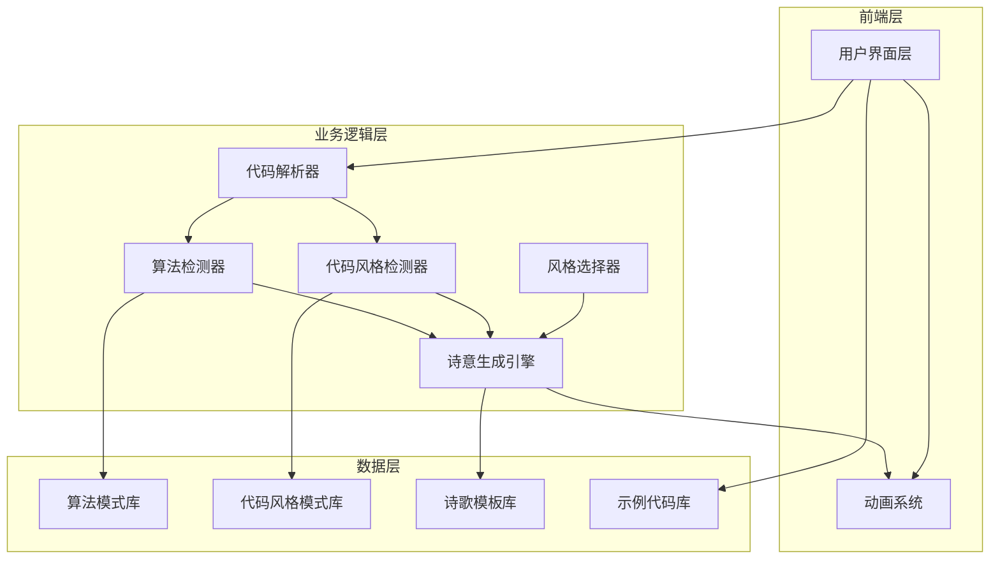

# CodePoet - 技术架构文档

## 1. 架构设计



## 2. 技术栈

- **框架**：纯 HTML + Vanilla JavaScript（无框架依赖）
- **样式**：原生 CSS + CSS 动画
- **字体**：Google Fonts (Noto Serif SC, Fira Code)
- **部署**：纯静态，直接部署到 GitHub Pages

## 3. 核心模块设计

### 3.1 代码解析器 (CodeParser)
**职责**：解析用户输入的代码
- 输入：原始代码字符串
- 输出：代码文本（供后续检测使用）
- 方法：直接传递原始代码到检测模块

### 3.2 算法检测器 (AlgorithmDetector)
**职责**：识别代码中的算法模式
- 支持30+种算法检测：
  - 排序算法：快速排序、归并排序、冒泡排序
  - 搜索算法：二分查找
  - 图遍历：DFS、BFS
  - 图算法：Dijkstra、Floyd、Prim、Kruskal
  - 动态规划：DP、斐波那契、背包问题
  - 贪心算法、回溯算法等

### 3.3 代码风格检测器 (StyleDetector)
**职责**：检测代码的编码风格
- 命名规范：驼峰式、下划线式、帕斯卡式、短横线式
- 注释风格：单行注释、多行注释、JSDoc
- 缩进风格：空格、制表符

### 3.4 诗意生成引擎 (PoetryEngine)
**职责**：核心诗意生成逻辑
- 风格路由：根据选择的诗风选择对应模板
- 模板选择：基于算法类型选择合适的诗歌模板
- 防重复机制：模板冷却机制，防止重复诗句

### 3.5 诗歌模板库 (PoemTemplates)
**支持12种诗风**：
- 古典诗、诗经、楚辞、乐府
- 唐诗、宋词、现代诗、禅诗
- 赛博朋克、俳句、打油诗、情诗

## 4. 数据结构

### 4.1 算法模式映射表
```javascript
const algorithmPatterns = {
  quickSort: /quickSort|partition.*pivot|divide.*conquer/i,
  mergeSort: /mergeSort|merge.*split/i,
  binarySearch: /binarySearch|binary.*search|mid.*left.*right/i,
  dfs: /dfs|depth.*first|recursive.*traversal/i,
  bfs: /bfs|breadth.*first|queue.*node/i,
  dijkstra: /dijkstra|priority.*queue|shortest.*path/i,
  dp: /dp|dynamic.*programming|memo/i,
  // ... 更多模式
};
```

### 4.2 代码风格模式映射表
```javascript
const codeStylePatterns = {
  camelCase: /([a-z][A-Z][a-z]+)|^[a-z][a-zA-Z]*$/,
  snakeCase: /^[a-z]+(_[a-z]+)*$/,
  pascalCase: /^[A-Z][a-zA-Z]*$/,
  comments: /(\/\/|\/\*|\*\/|#)/,
  jsDoc: /\/\*\*.*\*\//,
};
```

### 4.3 诗歌模板示例
```javascript
const poetryTemplates = {
  classic: {
    patterns: [
      { algo: 'sort', lines: ['乱序纷纭若散沙，', '一分为二辨等差。', '中枢定鼎乾坤转，', '万类霜天竞自华。'] },
      { algo: 'search', lines: ['幽林寻径意迟迟，', '折半方知路不迷。', '一点灵犀通表里，', '豁然开悟见真机。'] },
      // ... 更多模板
    ]
  },
  shi: {
    patterns: [
      { lines: ['蒹葭苍苍，白露为霜。', '代码如织，逻辑成章。'] },
      { lines: ['关关雎鸠，在河之洲。', '程序运行，无始无休。'] },
    ]
  },
  // ... 更多风格
};
```

## 5. 示例代码库

预置代码示例：
1. **快速排序**：经典分治算法
2. **二分查找**：高效搜索算法
3. **动态规划**：斐波那契数列
4. **BFS**：广度优先搜索
5. **DFS**：深度优先搜索
6. **Dijkstra**：最短路径算法

## 6. 动画系统

### 6.1 淡入效果
- 诗句逐行淡入
- 间隔 150ms
- opacity 0 → 1

### 6.2 背景效果
- 深色渐变背景
- 卡片毛玻璃效果

### 6.3 按钮悬停效果
- 上移动画
- 阴影增强

## 7. 响应式设计

- **桌面优先**（900px+）：双栏布局
- **移动端**（< 900px）：单栏布局

## 8. 性能优化

- 纯静态部署，无需服务器
- 算法检测使用正则表达式，快速高效
- 模板冷却机制避免重复计算

## 9. 防重复机制

- 模板冷却时间：10秒
- 最多保留5个最近使用的模板索引
- 确保相同代码不生成重复诗句

## 10. 部署方案

- **方式**：纯静态 HTML 文件
- **部署目标**：GitHub Pages
- **配置**：直接部署 `main` 分支根目录